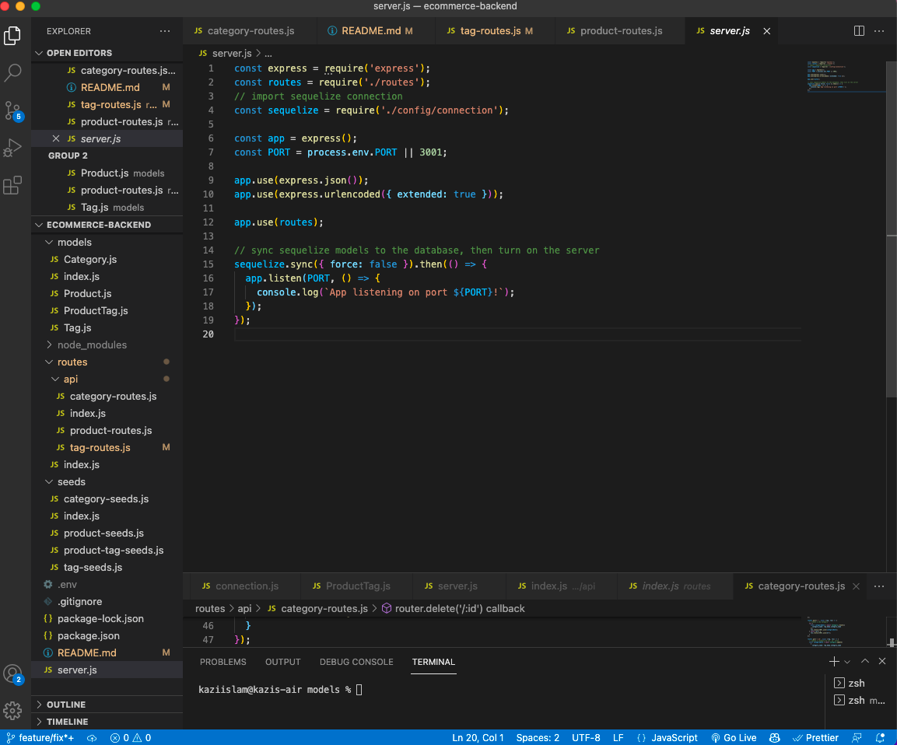

# ECOMMERCE-BACKEND

### Description:
```
Internet retail, also known as e-commerce, is the largest sector of the electronics industry, having generated an estimated US$29 trillion in 2017 (Source: United Nations Conference on Trade and Development). E-commerce platforms like Shopify and WooCommerce provide a suite of services to businesses of all sizes. Due to the prevalence of these platforms, developers should understand the fundamental architecture of e-commerce sites.

Your challenge is to build the back end for an e-commerce site. You’ll take a working Express.js API and configure it to use Sequelize to interact with a MySQL database.

Because this application won’t be deployed, you’ll also need to create a walkthrough video that demonstrates its functionality and all of the following acceptance criteria being met. You’ll need to submit a link to the video and add it to the README of your project.
```
## User Story
```
AS A manager at an internet retail company
I WANT a back end for my e-commerce website that uses the latest technologies
SO THAT my company can compete with other e-commerce companies
```

## Acceptance Criteria
```
GIVEN a functional Express.js API
WHEN I add my database name, MySQL username, and MySQL password to an environment variable file
THEN I am able to connect to a database using Sequelize
WHEN I enter schema and seed commands
THEN a development database is created and is seeded with test data
WHEN I enter the command to invoke the application
THEN my server is started and the Sequelize models are synced to the MySQL database
WHEN I open API GET routes in Insomnia for categories, products, or tags
THEN the data for each of these routes is displayed in a formatted JSON
WHEN I test API POST, PUT, and DELETE routes in Insomnia
THEN I am able to successfully create, update, and delete data in my database
```


## Table of contents
1. [Title](#title)
2. [Description](#description)
3. [Installation](#installation)
4. [Usage](#usage)
5. [Contributing](#contributing)
6. [Test](#test)
7. [License](#license)
8. [Questions](#questions)

## Title
ECOMMERCE-BACKEND

## Description
Object-Relational Mapping (ORM) Challenge: E-commerce Back End

## Installation
Run `npm install`; once completed run `npm start`

## Usage
Run `npm start` Since this application is not giong to accessible via web-browser use insomnia or other type of GUI based application to test API Routes

## Contributing
Always create a PR with own branch and push for review/approval

## Test
Test on local environment

## License
[MIT](https://gist.github.com/nicolasdao/a7adda51f2f185e8d2700e1573d8a633#mit-license)

## Questions
Nothing at this time<br />
Find me on Github [kazichaska](https://github.com/kazichaska)<br />
Email me with any question: kazichaska@gmail.com <br />

## Deployed Application Video Link 
Below is the recorded video link of deployed application and how to use it:


## Screenshots of the code





